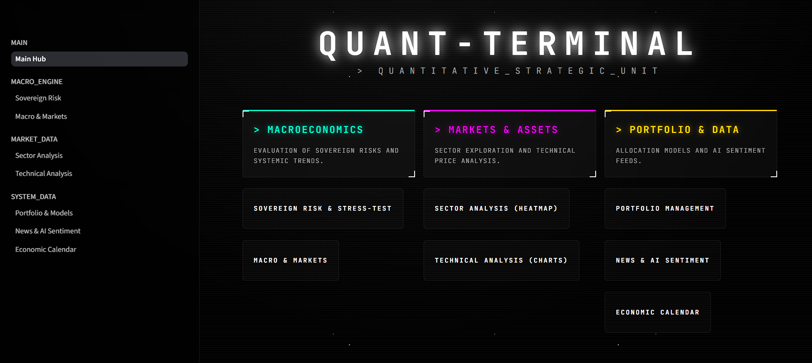
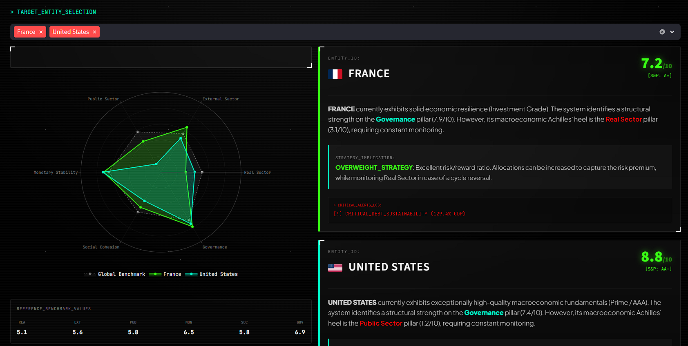
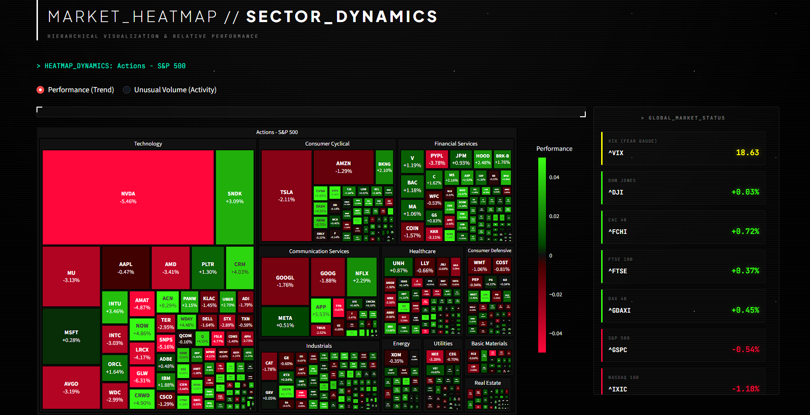
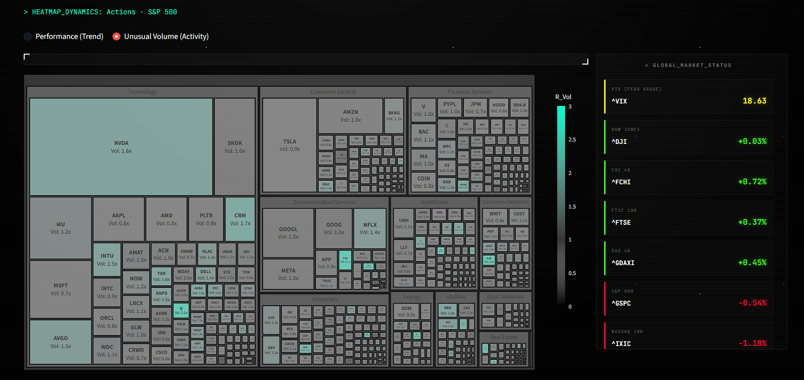
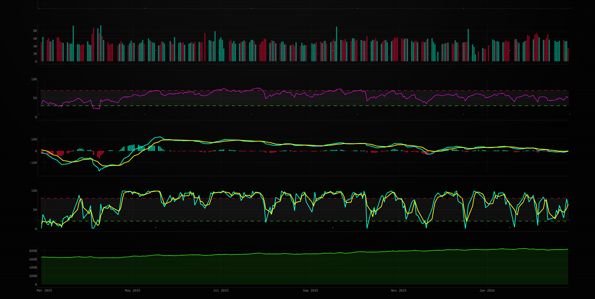
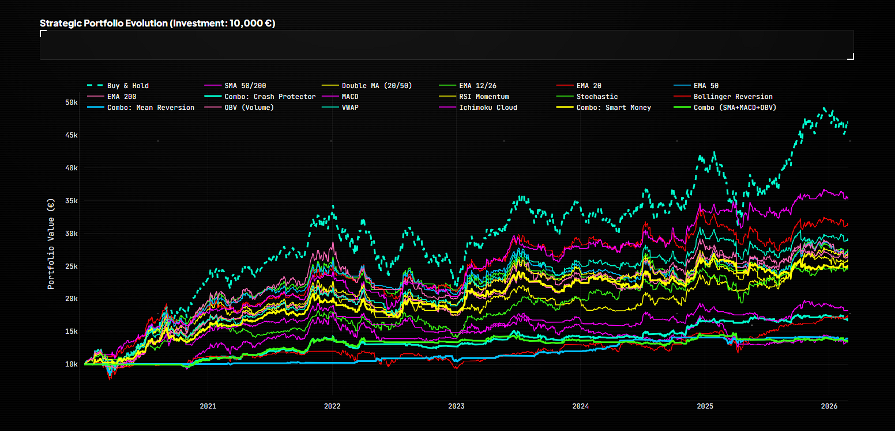
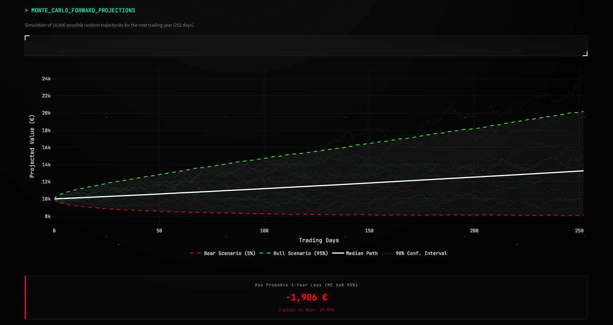
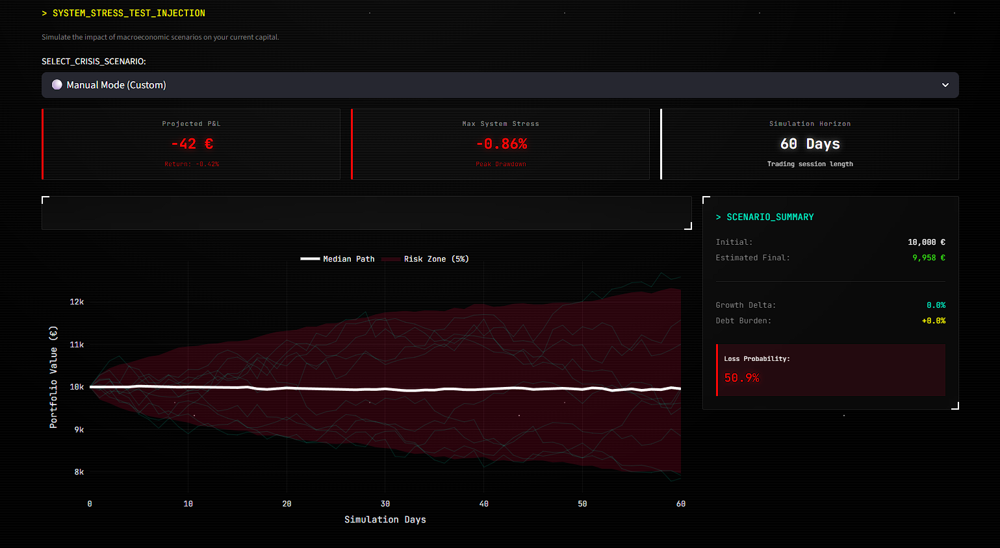

<h1 align="center">
  QUANT-TERMINAL
</h1>

<h4 align="center">Quantitative Strategic Unit & Market Dashboard</h4>

<p align="center">
  
  
  
  
  
</p>

<p align="center">
  <strong>Macroeconomics • Portfolio Optimization • Technical Analysis • AI Sentiment • Sovereign Risk</strong>
</p>

---

## Overview

**Quant-Terminal** is a comprehensive, multi-page financial dashboard built with Streamlit. Designed with a custom "Holographic Neon" terminal aesthetic, it serves as a central hub for deep quantitative analysis, macro-financial modeling, and algorithmic portfolio management.

Whether you are conducting academic econometric research, backtesting technical trading strategies, or assessing sovereign debt sustainability, this terminal aggregates real-time data and advanced mathematical models into a single, high-performance UI.

## Core Modules

### 1. Macroeconomics & Sovereign Risk
* **Global Sovereign Risk Mapping (`sovereignrisk.py`):** Algorithmic stress-testing of 218 countries. Analyzes 6 macroeconomic pillars (Real Sector, External Sector, Public Sector, Monetary Stability, Social Cohesion, Governance) using World Bank & IMF data to estimate S&P-style ratings.
* **Macro & FX Engine (`macro_analysis.py`):** Real-time foreign exchange spot rate matrices, relative purchasing power tracking, and cross-asset correlation heatmaps.

### 2. Markets & Assets
* **Sector Analysis Heatmap (`sector_analysis.py`):** Hierarchical Treemap visualizations of market dynamics, tracking relative volume anomalies and sectoral rotation.
* **Technical Analysis (`app.py`):** Interactive, fully customizable charting using Plotly. Features standard indicators (SMA, EMA, MACD, RSI, Stochastic, Bollinger Bands, Ichimoku Cloud, VWAP) alongside a built-in visual Trade Simulator for planning and backtesting.

### 3. Portfolio & AI
* **System Allocator (`portfolio.py`):** Advanced portfolio construction utilizing Markowitz Efficient Frontier, Risk Parity, and Black-Litterman models. Includes a full Monte Carlo forward projection engine, Maximum Drawdown analysis, and a Macro Scenario Stress-Tester.
* **NLP Sentiment Scanner (`news_analysis.py`):** Integrates HuggingFace's `ProsusAI/finbert` model to scan real-time financial news, computing a live Fear & Greed index and extracting institutional sentiment from news headlines and summaries.
* **Economic Calendar (`calendar_events.py`):** Aggregates macroeconomic events (ForexFactory) and microeconomic corporate events (Earnings & Ex-Dividend dates).

---

## 🌐 Main page

**Main Hub/Page**

---

## 🚀 Core Modules

### 1. 🌍 Macroeconomics & Sovereign Risk

* **Global Sovereign Risk Mapping (`sovereignrisk.py`):** Algorithmic stress-testing of 218 countries. Analyzes 6 macroeconomic pillars (Real Sector, External Sector, Public Sector, Monetary Stability, Social Cohesion, Governance) using World Bank & IMF data to estimate S&P-style ratings.
* **Macro & FX Engine (`macro_analysis.py`):** Real-time foreign exchange spot rate matrices, relative purchasing power tracking, and cross-asset correlation heatmaps.

#### 📸 Sovereign Risk Diagnostics (`sovereignrisk.py`)

**Global Risk Mapping**


**Safety vs Growth Matrix**


**Sovereign Radar & Scoring**


**Pillar Breakdown**


**Stress-Test Simulator**


**Post-Shock Structural Deviation**


#### 📸 Macro & FX Engine (`macro_analysis.py`)

**FX Spot Matrix**


**Purchasing Power Movers**


**Currency Base 100 Chart**


**Cross-Asset Correlation Matrix**


---

### 2. 📊 Markets & Assets

* **Sector Analysis Heatmap (`sector_analysis.py`):** Hierarchical Treemap visualizations of market dynamics, tracking relative volume anomalies and sectoral rotation.
* **Technical Analysis (`app.py`):** Interactive, fully customizable charting using Plotly.

#### 📸 Sector Analysis Dynamics (`sector_analysis.py`)

**S&P 500 Performance Heatmap**


**S&P 500 Unusual Volume Heatmap**


**Market Breadth & Distribution**


**Extreme Oscillation Scanner**


**Sectorial Volume Ranking**


#### 📸 Technical Analysis & Charting (`app.py`)

**Interactive Price Action Charting**


**Advanced Oscillator Suite**


**Visual Trade Planner (Crosshair Selection)**


**Strategy Backtesting Results**


---

### 3. 💼 Portfolio & AI

* **System Allocator (`portfolio.py`):** Advanced portfolio construction utilizing Markowitz Efficient Frontier, Risk Parity, and Black-Litterman models.
* **NLP Sentiment Scanner (`news_analysis.py`):** Integrates HuggingFace's `ProsusAI/finbert` model.
* **Economic Calendar (`calendar_events.py`):** Macro & Micro events tracking.

#### 📸 System Allocator & Tracking (`portfolio.py`)

| Asset Selection | Allocation Setup |
|:---:|:---:|
|  |  |

**Active Positions Detail**


**Historical Trajectory vs Benchmark**


#### 📸 Quantitative Optimization & Allocation Models

**Markowitz Efficient Frontier & Correlation**


**Black-Litterman & Risk Parity Models**


#### 📸 Algorithmic Backtesting Lab

**Max Drawdown & Strategy Setup**


**Strategic Portfolio Evolution**


#### 📸 Risk Management & Strategy Comparison

**Strategy Performance Metrics**


**Value at Risk (VaR) Engine**


#### 📸 Advanced Risk & Monte Carlo Projections

**Monte Carlo Forward Projections**


**System Stress-Test Injection**


**Resilience Comparative Matrix**


#### 📸 NLP Sentiment Scanner (`news_analysis.py`)

**AI Sentiment Driver Analysis**


#### 📸 Market Calendar & Corporate Events (`calendar_events.py`)

**Macroeconomic Events Calendar**


**Corporate Earnings Schedule**


**Ex-Dividend Dates Tracker**

---

## Tech Stack

* **Frontend/Framework:** Streamlit, HTML/CSS (Custom Glassmorphism/HUD UI via `style_utils.py`)
* **Data Retrieval:** `yfinance`, `pandas_datareader`, `requests`, World Bank API
* **Data Processing:** `pandas`, `numpy`, `scipy.optimize`
* **Visualization:** `plotly.express`, `plotly.graph_objects`
* **Machine Learning:** `transformers` (Hugging Face Pipeline)

## Installation & Setup

1. **Clone the repository:**
```bash
git clone [https://github.com/yourusername/quant-terminal.git](https://github.com/valentinhamon35/quant-terminal.git)
cd quant-terminal
```

2. **Create a virtual environment (recommended):**
```bash
python -m venv venv
source venv/bin/activate  # On Windows use: venv\Scripts\activate
```

3. **Install dependencies:**
```bash
pip install -r requirements.txt
```

4. **Configure your assets:**
Ensure you have a `config_assets.py` file in the root directory that defines your investment universe (e.g., a dictionary returning sectors and tickers).

5. **Run the terminal:**
```bash
streamlit run main.py
```

## Project Structure

```text
quant-terminal/
├── main.py                # Main hub and Streamlit page routing
├── style_utils.py         # Global CSS, Neon/Holo UI design system, and signature
├── app.py                 # Technical analysis & charting engine
├── macro_analysis.py      # Cross-asset correlations and FX matrix
├── sovereignrisk.py       # Macro stress-testing and sovereign rating AI
├── sector_analysis.py     # Treemap and market breadth
├── portfolio.py           # Allocation models (Markowitz, Black-Litterman, Monte Carlo)
├── news_analysis.py       # FinBERT NLP sentiment analysis
├── calendar_events.py     # Macro & Micro economic event tracking
├── config_assets.py       # (User defined) Market structure and ticker dictionaries
└── requirements.txt       # Project dependencies
```

## Authors

Developed as part of academic and quantitative research initiatives at the **Université de Rennes** (Master in Money, Banking, Finance, and Insurance, specializing in Economic and Financial Engineering).

**Powered By:** 
* Valentin Hamon
* Aelaig Nicolle

<p align="center">

</p>

---
*Disclaimer: This software is for academic and informational purposes only and does not constitute financial advice.*


